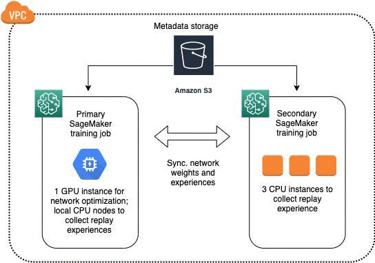
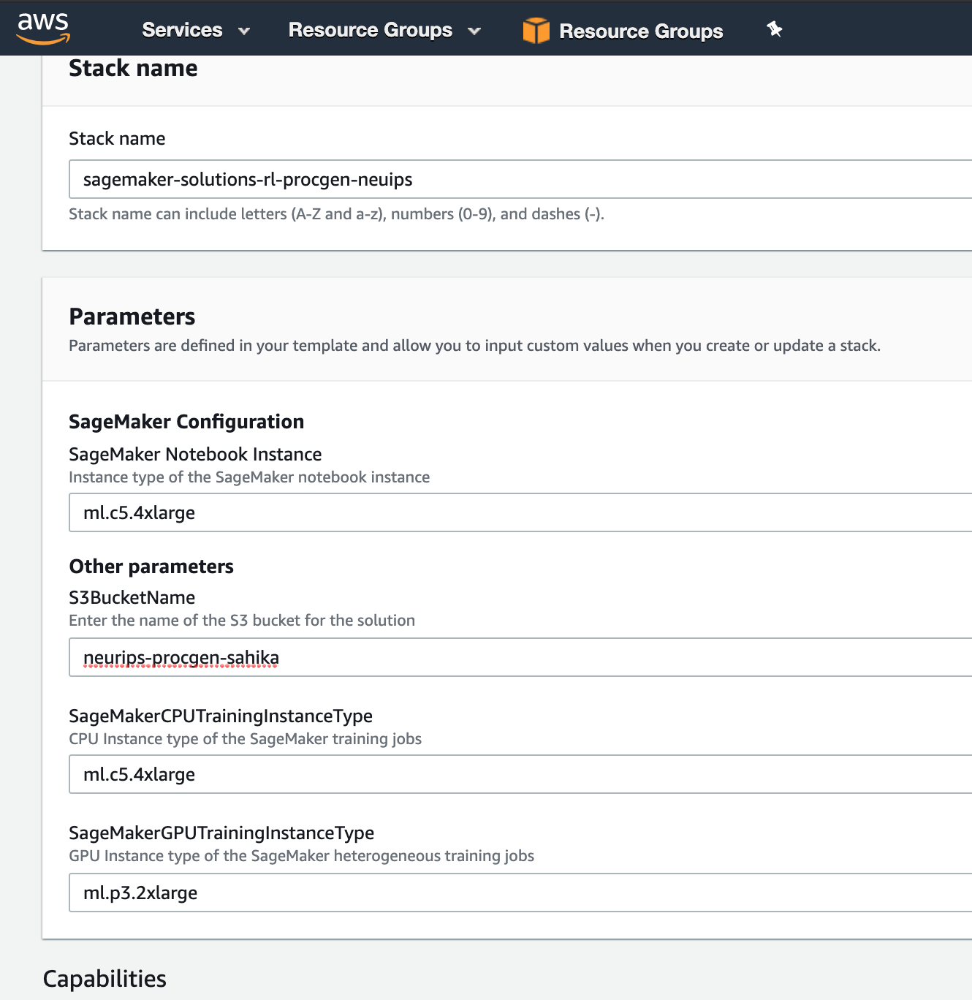

# NeurIPS 2020 - Procgen Starter Kit with Amazon SageMaker Reinforcement Learning
This is the Amazon SageMaker Reinforcement Learning starter kit for the [NeurIPS 2020 - Procgen competition](https://www.aicrowd.com/challenges/neurips-2020-procgen-competition) hosted on [AIcrowd](https://www.aicrowd.com/).
​
Amazon SageMaker is a fully managed service that enables you to build and deploy models faster and with less heavy lifting. Amazon SageMaker has built-in features to assist with data labeling and preparation; training, tuning and debugging models; and deploying and monitoring models in production. This notebook uses the fully managed RL capabilities in Amazon SageMaker, which include pre-packaged RL toolkits and fully managed model training and deployment and builds on top of the algorithms and libraries of the [NeurIPS 2020 - Procgen competition](https://www.aicrowd.com/challenges/neurips-2020-procgen-competition) hosted on [AIcrowd](https://www.aicrowd.com/) Additionally, Amazon SageMaker Managed Spot Training is used to reduce training costs by up to 90%. 
​
For more information, see Amazon SageMaker Experiments – Organize, Track And Compare Your Machine Learning Trainings. For more information about applying RL to domains such as recommendation systems, robotics, financial management, and more, see the [GitHub repo](https://github.com/awslabs/amazon-sagemaker-examples/tree/master/reinforcement_learning).

# 🕵️ About ProcGen Benchmark

16 simple-to-use procedurally-generated [gym](https://github.com/openai/gym) environments which provide a direct measure of how quickly a reinforcement learning agent learns generalizable skills.  The environments run at high speed (thousands of steps per second) on a single core.

These environments are associated with the paper [Leveraging Procedural Generation to Benchmark Reinforcement Learning](https://cdn.openai.com/procgen.pdf) [(citation)](#citation). Compared to [Gym Retro](https://github.com/openai/retro), these environments are:

* Faster: Gym Retro environments are already fast, but Procgen environments can run >4x faster.
* Non-deterministic: Gym Retro environments are always the same, so you can memorize a sequence of actions that will get the highest reward.  Procgen environments are randomized so this is not possible.
* Customizable: If you install from source, you can perform experiments where you change the environments, or build your own environments.  The environment-specific code for each environment is often less than 300 lines.  This is almost impossible with Gym Retro.

# 💪 Getting Started with Amazon SageMaker 

### Get an AWS account
​
You will need an AWS account to use this solution. Sign up for an account here (https://aws.amazon.com/).
You will also need to have permission to use AWS CloudFormation (https://aws.amazon.com/cloudformation/) and to create all the resources detailed in the architecture section (https://github.com/awslabs/aws-fleet-predictive-maintenance/#architecture). All AWS permissions can be managed through AWS IAM (https://aws.amazon.com/iam/). Admin users will have the required permissions, but please contact your account's AWS administrator if your user account doesn't have the required permissions.

### Architecture
As part of the solution, the following services are used:

1. [Amazon S3](https://aws.amazon.com/s3/): Used to store datasets.
2. [Amazon SageMaker Notebook](https://aws.amazon.com/sagemaker/): Used to preprocess and visualize the data, and to train the deep learning model.

Amazon SageMaker Reinforcement Learning utilizes Amazon S3, Amazon SageMaker, and ...

A typical Amazon SageMaker Reinforcement Learning job for an actro-critic algorithm will use GPU instances to learning a policy network and CPU instances to collect experiences for faster training at optimized costs. Amazon SageMaker allows you to achieve this by spinning up two jobs within the same Amazon VPC, and the communications between the instances are taken care of automatically. The following diagram illustrates the architecture in which the primary job consumes one GPU instance and the secondary job consumes three CPU instances.

### Cost

You will be given credits to use any AWS service, please contact AICrowd for details. 

You are responsible for the cost of the AWS services used while running this solution. For details refer to the pricing listed at [Amazon SageMaker Pricing](https://aws.amazon.com/sagemaker/pricing/).

As of September 1, 2020, the Amazon SageMaker training cost (excluding notebook instance) are listed as:
* ml.c5.4xlarge	$0.952 per hour (16 vCPU)
* ml.g4dn.4xlarge	$1.686 per hour (1 GPU, 16 vCPU)
* ml.p3.2xlarge	$4.284 per hour (1 GPU, 8 vCPU)

 
### Launch the solution
​
While logged on to your AWS account, click on the link to quick create the AWS CloudFormation Stack for the region you want to run your notebook:
​
<table>
  <tr>
    <th colspan="3">AWS Region</td>
    <th>AWS CloudFormation</td>
  </tr>
  <tr>
    <td>US West</td>
    <td>Oregon</td>
    <td>us-west-2</td>
    <td align="center">
      
    </td>
  </tr>
</table>
​
The above link will take you to the AWS CloudFormation page to create a stack as seen in the screen shot below.

You should acknowledge the use of the instance type for Amazon SageMaker Notebook and Training Instance. Make sure that your AWS account has the limits for required instances. If you need to increase the limits for the instances you wish to use, please contact AWS Support.

The final parameter is the name of the S3 bucket for the solution. The default is `procgen`. Please, provide a unique name for this to ensure there are no conflicts with your existing S3 buckets. An Amazon S3 bucket name is globally unique, and the namespace is shared by all AWS accounts. This means that after a bucket is created, the name of that bucket cannot be used by another AWS account in any AWS Region until the bucket is deleted.

Now, click `Create Stack`. You can monitor the progress of your stack by clicking `Event` tab or refreshing your screen. Once stack creation has completed successfully, go to the Amazon SageMaker console. You notebook should already be created and its status should read `InService`. 

You are now ready to start training!

### Training

To start training the model, go to Amazon SageMaker > Notebook instances > rl-procgen-neurips and click `Open Jupyter` or `Open JupyterLab` tab. Then, click on the  notebook named `train.ipynb`.

### Rollout

# Submission [Same as in NeurIPS 2020 - Procgen competition]
​
Same as in [NeurIPS 2020 - Procgen competition](https://www.aicrowd.com/challenges/neurips-2020-procgen-competition) hosted on [AIcrowd](https://www.aicrowd.com/).
​
Happy Submitting!! :rocket:
​
​
# FAQs

## How do I change the notebook instance type?
The Amazon SageMaker notebook instance type is configured as part of the cloud formation parameters. The default instance type in the cloud formation stack is `ml.c5.4xlarge`. If you wish to change the instance type, you would need to change the parameter for the notebook instance. This instance type enables you to run your notebook in `local mode` to quickly test your custom model, parameters, or algorithms in the notebook instance. We recommended that once you debug customizations, then you can switch to a notebook instance with smaller compute and use powerful compute instances to iterate through various hyper-parameters in training.

## How do I change the training instance type(s)?
You can change the instance type to a GPU or CPU instance. In the notebook, the docker container is selected according to the type of the instance, e.g., the GPU instances start with `ml.p` or `ml.g`. There are there steps to configuring the instance type for training:

Step 1: Prior to changing the instance type you need to confirm that your AWS account limit for the specific instance. Please, refer to the instructions on the [Amazon EC2 Service Quotas](https://docs.aws.amazon.com/AWSEC2/latest/UserGuide/ec2-resource-limits.html) on how to confirm the instance limits.

Step 2: In `train.ipynb`, go to the section titled *Configure training instance type* and override `instance_type`.

Step 3: You need to make sure that your Ray training job is configured to use the resources in the training instance. Go to `source\train-sagemaker.py`. Edit ...

To automatically scale the RL training to several workers, you can adjust the `num_cpus` and `num_gpus` parameters. You must reserve 1 CPU (the 1 in num_cpus - 1) to act as the driver. For example, if you select a training instance type with at least 4 CPUs, then configure a training job with multiple workers in a single Amazon SageMaker instance by settting 'num_cpus' = 3 and 'num_gpus' = 0.

## How do I use homogeneous or heteregenous distributed training?

## How do I use spot instances for distributed training?

## How do I add a custom Model ? [Sahika to update the folder paths]
To add a custom model, create a file inside `models/` directory and name it `models/my_vision_network.py`.

Please refer [here](https://github.com/AIcrowd/neurips2020-procgen-starter-kit/blob/master/models/my_vision_network.py ) for a working implementation of how to add a custom model. You can then set the `custom_model` field in the experiment yaml to `my_vision_network` to cause that model to be used.

## How do I add a custom Algorithm/Trainable/Agent ?

## What configs parameters do I have available ? 

## How do I visualize the algorithm metrics while training ?
There are several options to visualize algorithm metrics. A detailed blog can be found [here](https://aws.amazon.com/blogs/machine-learning/easily-monitor-and-visualize-metrics-while-training-models-on-amazon-sagemaker/).

Option 1 (Amazon CloudWatch): You can go to the [Amazon CloudWatch](https://aws.amazon.com/cloudwatch/) metrics dashboard from your account to monitor and visualize the algorithm metrics as well as track the GPU and CPU usage. The training jobs details page has a direct link to the Amazon CloudWatch metrics dashboard for the metrics emitted by the training algorithm.

Option 2 (Amazon SageMaker Python SDK API): You can also visualize the metrics inline in your Amazon SageMaker Jupyter notebooks using the Amazon SageMaker Python SDK APIs. Please, refer to the section titled *Visualize algorithm metrics for training* in `train.ipynb`.

Option 3: Tensorboard ... 

# Author(s)
- [Anna Luo](https://github.com/annaluo676)
- [Jonathan Chung](https://github.com/jonomon)
- [Yunzhe Tao](https://github.com/yunzhe-tao)
- [Sahika Genc](https://github.com/sahikagenc)
- [Sharada Mohanty](https://twitter.com/MeMohanty/)
- [Karl Cobbe](https://github.com/kcobbe)
- [Jyotish](https://github.com/jyotishp)
- [Shivam Khandelwal](https://github.com/skbly7)

## License

This project is licensed under the Apache-2.0 License.
